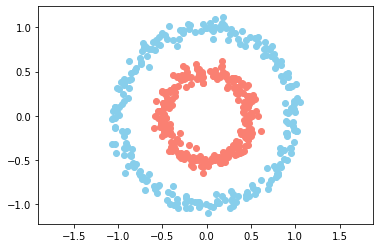
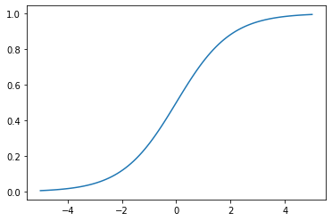

# 04---RED-NEURONAL-1

```python
import numpy as np
import scipy as sc
import matplotlib.pyplot as plt
from sklearn.datasets import make_circles
```


```python
n = 500
p = 2

X,Y = make_circles(n_samples=n, factor=0.5, noise=0.05)

Y = Y[:, np.newaxis]


plt.scatter(X[Y[:, 0] == 0, 0], X[Y[:, 0] == 0, 1], c="skyblue")
plt.scatter(X[Y[:, 0] == 1, 0], X[Y[:, 0] == 1, 1], c="salmon")

plt.axis("equal")
plt.show()
```





```python
X.shape
```


    (500, 2)


```python
Y.shape
```


    (500, 1)


```python
# CLASE DE LA CAPA DE LA RED

class neural_layer():
    
    def __init__(self, n_conn, n_neur, act_f):
        
        self.act_f = act_f
        
        self.b = np.random.rand(1, n_neur) * 2 - 1
        self.W = np.random.rand(n_conn, n_neur) * 2 -1
        
```


```python
# FUNCION DE ACTIVACIÓN

sigm = (lambda x: 1 / (1 + np.e ** (-x)),
        lambda x: x * (1 - x))

relu = lambda x: np.maximum(0, x)

_x = np.linspace(-5, 5, 100)
plt.plot(_x, sigm[0](_x))
```


    [<matplotlib.lines.Line2D at 0x1a18e13990>]





```python
l0 = neural_layer(p, 4, sigm)
l1 = neural_layer(4, 8, sigm)

def create_nn(topology, act_f):
    
    nn = []
    
    for l, layer in enumerate(topology[:-1]):
        
        nn.append(neural_layer(topology[1], topology[l+1], act_f))
        
    return nn
```


```python
topology = [p, 2, 2, 2, 2, 1]

neural_net = create_nn(topology, sigm)


def train(neural_net, X, Y, l2_cost, lr=0.5, train=True):
    
    out = [(None, X)]
    
    for l, layer in enumerate(neural_net):
        
        z = out[-1][1] @ neural_net[l].W + neural_net[l].b
        
        a = neural_net[l].act_f[0](z)
        
        out.append((z, a))
        
    print(l2_cost[0](out[-1][1], Y))
    
    if train:
        
        deltas = []
        
        for l in reversed(range(0, len(neural_net))):
            
            z = out[l+1][0]
            a = out[l+1][1]
                        
            if l == len(neural_net) - 1:
                deltas.insert(0, l2_cost[1](a, Y) * neural_net[l].act_f[1](a))
            else:
                deltas.insert(0, deltas[0] @ _W.T * neural_net[l].act_f[1](a))
                
            _W = neural_net[l].W 
        
            neural_net[l].b = neural_net[l].b - np.mean(deltas[0], axis=0, keepdims=True) * lr
            
            neural_net[l].W = neural_net[l].W - out[l][1].T @ deltas[0] * lr

            
    return out[-1][1]

train(neural_net, X, Y, l2_cost, 0.5)
    
```

    0.2653412083117705


    array([[0.37616783],
           [0.37613184],
           [0.37614159],
           [0.37613825],
           [0.37616555],
           [0.37612217],
           [0.37612483],
           [0.37614193],
           [0.37612939],
           [0.37616386],
           [0.37611881],
           [0.37614457],
           [0.37616113],
           [0.37612409],
           [0.37614938],
           [0.37615185],
           [0.37613517],
           [0.37615149],
           [0.37615682],
           [0.37613212],
           [0.37615313],
           [0.37614649],
           [0.37613029],
           [0.3761464 ],
           [0.37616104],
           [0.37616889],
           [0.37616569],
           [0.37615057],
           [0.37611912],
           [0.37614661],
           [0.37615321],
           [0.37616688],
           [0.37613438],
           [0.376166  ],
           [0.37613281],
           [0.37613893],
           [0.37616918],
           [0.37615394],
           [0.37613291],
           [0.37613137],
           [0.37614072],
           [0.37614927],
           [0.37615042],
           [0.37616633],
           [0.37611004],
           [0.37615074],
           [0.37613648],
           [0.37615931],
           [0.37615896],
           [0.37614583],
           [0.37615545],
           [0.37616041],
           [0.3761561 ],
           [0.37614   ],
           [0.37614801],
           [0.37614373],
           [0.37615218],
           [0.37613922],
           [0.3761282 ],
           [0.37615009],
           [0.37614267],
           [0.37611572],
           [0.37615898],
           [0.37613267],
           [0.37616768],
           [0.37614669],
           [0.37612807],
           [0.3761333 ],
           [0.37610977],
           [0.37613584],
           [0.37615055],
           [0.37613284],
           [0.37611862],
           [0.37613918],
           [0.37611036],
           [0.37614682],
           [0.37611204],
           [0.37612632],
           [0.37611455],
           [0.37612403],
           [0.37614644],
           [0.3761259 ],
           [0.37615066],
           [0.37611413],
           [0.37613788],
           [0.37615064],
           [0.37614199],
           [0.37612417],
           [0.37613447],
           [0.37611915],
           [0.37611787],
           [0.37614015],
           [0.37613193],
           [0.37613272],
           [0.37614782],
           [0.37616842],
           [0.37615213],
           [0.37614894],
           [0.37616271],
           [0.37614796],
           [0.37610987],
           [0.376129  ],
           [0.3761445 ],
           [0.37614856],
           [0.37613286],
           [0.37612573],
           [0.37616884],
           [0.37612853],
           [0.37611036],
           [0.37613858],
           [0.37613709],
           [0.37616586],
           [0.37614579],
           [0.37612589],
           [0.37615882],
           [0.37614984],
           [0.37616307],
           [0.37616771],
           [0.37615214],
           [0.37612508],
           [0.37615381],
           [0.37612729],
           [0.37612826],
           [0.37611104],
           [0.37616468],
           [0.37612668],
           [0.37612423],
           [0.3761226 ],
           [0.37613331],
           [0.37614683],
           [0.37613586],
           [0.37613362],
           [0.37613297],
           [0.37614683],
           [0.37615312],
           [0.37616574],
           [0.37612467],
           [0.37615333],
           [0.37613576],
           [0.37615714],
           [0.37615059],
           [0.37616875],
           [0.37613365],
           [0.37611385],
           [0.37612321],
           [0.37613181],
           [0.37616679],
           [0.37613288],
           [0.37613672],
           [0.3761172 ],
           [0.37611057],
           [0.37612016],
           [0.37615238],
           [0.37612734],
           [0.37615393],
           [0.37615578],
           [0.37616243],
           [0.37612652],
           [0.37615325],
           [0.37615352],
           [0.37612417],
           [0.37614662],
           [0.37611362],
           [0.37615148],
           [0.37611451],
           [0.37610958],
           [0.3761198 ],
           [0.37612884],
           [0.37611461],
           [0.37615316],
           [0.3761354 ],
           [0.37612961],
           [0.37613226],
           [0.37611096],
           [0.37611566],
           [0.37614167],
           [0.37614247],
           [0.37615191],
           [0.3761121 ],
           [0.37614357],
           [0.37610856],
           [0.3761128 ],
           [0.3761652 ],
           [0.37616669],
           [0.37614519],
           [0.37612811],
           [0.37611365],
           [0.37612065],
           [0.37613507],
           [0.37615428],
           [0.37614616],
           [0.37614109],
           [0.37615979],
           [0.37613679],
           [0.37614616],
           [0.37612094],
           [0.37613493],
           [0.37610931],
           [0.37616323],
           [0.37612367],
           [0.37614359],
           [0.37613126],
           [0.37612607],
           [0.37615491],
           [0.37613992],
           [0.37613775],
           [0.37615364],
           [0.37614055],
           [0.3761548 ],
           [0.37612386],
           [0.37614453],
           [0.37612631],
           [0.37616505],
           [0.37611273],
           [0.37614564],
           [0.37612877],
           [0.37611178],
           [0.37612623],
           [0.37615043],
           [0.37615502],
           [0.37615316],
           [0.37611624],
           [0.37613542],
           [0.37612601],
           [0.37611101],
           [0.37612367],
           [0.37616357],
           [0.37612654],
           [0.37613434],
           [0.37612969],
           [0.37614126],
           [0.37611745],
           [0.37612934],
           [0.37614778],
           [0.37615277],
           [0.37616606],
           [0.37612787],
           [0.37614507],
           [0.3761487 ],
           [0.37614513],
           [0.3761278 ],
           [0.3761146 ],
           [0.37616677],
           [0.37616244],
           [0.37615508],
           [0.37615593],
           [0.37611153],
           [0.37611369],
           [0.37611106],
           [0.37614234],
           [0.37615091],
           [0.37612708],
           [0.37611989],
           [0.3761523 ],
           [0.37611222],
           [0.37613112],
           [0.37616866],
           [0.37615318],
           [0.37615649],
           [0.37611531],
           [0.37614683],
           [0.3761523 ],
           [0.37615242],
           [0.37613708],
           [0.37614725],
           [0.37611752],
           [0.37612905],
           [0.37616838],
           [0.37614697],
           [0.37611292],
           [0.37611691],
           [0.37615635],
           [0.37615263],
           [0.37614055],
           [0.37612446],
           [0.37611407],
           [0.376137  ],
           [0.37616222],
           [0.37611825],
           [0.37615825],
           [0.37616298],
           [0.37612392],
           [0.37615173],
           [0.37614172],
           [0.37616732],
           [0.37613858],
           [0.37614951],
           [0.37612767],
           [0.37615464],
           [0.37615383],
           [0.37613627],
           [0.37612637],
           [0.37612585],
           [0.37616814],
           [0.3761282 ],
           [0.37613465],
           [0.37614725],
           [0.3761407 ],
           [0.37614174],
           [0.37616082],
           [0.37614531],
           [0.37615489],
           [0.37610976],
           [0.3761666 ],
           [0.37612011],
           [0.3761294 ],
           [0.37612462],
           [0.37612767],
           [0.37612541],
           [0.37616201],
           [0.37612002],
           [0.37612799],
           [0.37614105],
           [0.37614617],
           [0.37611541],
           [0.37614697],
           [0.37614719],
           [0.37613335],
           [0.37612466],
           [0.37613958],
           [0.37616684],
           [0.3761329 ],
           [0.37612786],
           [0.37615195],
           [0.37612804],
           [0.3761663 ],
           [0.37615412],
           [0.37611004],
           [0.37615583],
           [0.37611406],
           [0.37612615],
           [0.37615151],
           [0.37613863],
           [0.37612496],
           [0.37614455],
           [0.37613063],
           [0.37614942],
           [0.37612946],
           [0.37615782],
           [0.37610991],
           [0.37612662],
           [0.37612947],
           [0.37614948],
           [0.37614606],
           [0.37613746],
           [0.37616362],
           [0.37612897],
           [0.37612707],
           [0.37612537],
           [0.37614177],
           [0.37613174],
           [0.3761613 ],
           [0.37615418],
           [0.37612856],
           [0.37615135],
           [0.37613187],
           [0.376125  ],
           [0.3761621 ],
           [0.37613843],
           [0.37615704],
           [0.37612691],
           [0.3761213 ],
           [0.37614797],
           [0.37611135],
           [0.37615304],
           [0.37612388],
           [0.37611365],
           [0.37613557],
           [0.37615045],
           [0.37615522],
           [0.37611944],
           [0.37611646],
           [0.37612457],
           [0.37610994],
           [0.37615487],
           [0.37615186],
           [0.37613223],
           [0.37613441],
           [0.37614157],
           [0.37615167],
           [0.37614201],
           [0.37614791],
           [0.37613822],
           [0.37614639],
           [0.37613356],
           [0.37615175],
           [0.37614028],
           [0.37615437],
           [0.37615173],
           [0.37616497],
           [0.3761245 ],
           [0.37611267],
           [0.37615251],
           [0.3761491 ],
           [0.37612896],
           [0.37613779],
           [0.37613594],
           [0.37614289],
           [0.37611112],
           [0.37612604],
           [0.37612986],
           [0.37615078],
           [0.37614659],
           [0.37610895],
           [0.37616904],
           [0.37616926],
           [0.37613455],
           [0.37614706],
           [0.37613026],
           [0.37611502],
           [0.37612805],
           [0.37616198],
           [0.37615314],
           [0.37613759],
           [0.37615413],
           [0.37616585],
           [0.37614069],
           [0.37612972],
           [0.37612963],
           [0.37611227],
           [0.37611062],
           [0.37612902],
           [0.37615512],
           [0.3761267 ],
           [0.37613021],
           [0.37615465],
           [0.37612699],
           [0.37612613],
           [0.3761562 ],
           [0.37612748],
           [0.37614528],
           [0.37615246],
           [0.37612777],
           [0.37614196],
           [0.37611647],
           [0.37615308],
           [0.3761262 ],
           [0.37613306],
           [0.37613772],
           [0.37614343],
           [0.37616724],
           [0.3761353 ],
           [0.37612802],
           [0.37616838],
           [0.37613192],
           [0.37612382],
           [0.37613892],
           [0.37614561],
           [0.37615178],
           [0.37616927],
           [0.37612816],
           [0.37612166],
           [0.37615607],
           [0.3761699 ],
           [0.37613435],
           [0.37616889],
           [0.37616089],
           [0.37612533],
           [0.37612394],
           [0.37615398],
           [0.37615043],
           [0.37615619],
           [0.37616442],
           [0.37614549],
           [0.37616774],
           [0.37614937],
           [0.37614073],
           [0.37612656],
           [0.37615359],
           [0.37612975],
           [0.37614227],
           [0.37614844],
           [0.37613216],
           [0.37614739],
           [0.37612889],
           [0.37613102],
           [0.37615034],
           [0.37616192],
           [0.37616696],
           [0.37611   ],
           [0.37614177],
           [0.37611399],
           [0.37610987],
           [0.37611778],
           [0.37616617],
           [0.37612772],
           [0.37612299],
           [0.37615599],
           [0.37615823],
           [0.3761303 ],
           [0.37613253],
           [0.3761129 ],
           [0.37613343],
           [0.37612415],
           [0.37611552],
           [0.37613917],
           [0.37614523],
           [0.37613512],
           [0.37614579],
           [0.37616397]])


```python

```
